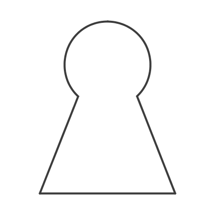
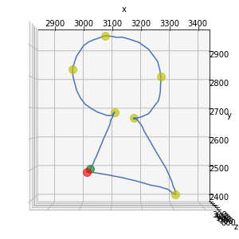
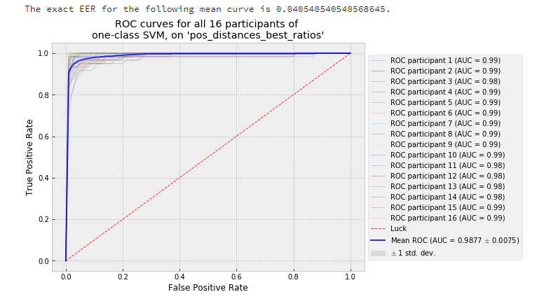

## Graduation Project

This repo holds a Data Collection Application, and the code for some subsequent Machine Learning models that were developed for a Graduation Project for Media Technology M. Sc. The purpose of the models, was to recognize if the drawings were from the same person, while all users were requested to draw the same symbol.

*The lock symbol that was drawn in the air by all participants*

### Data Collection Application

The Data Collection application was used to collect air-drawings of the above lock symbol. The drawings were made by the fingertip of each participant while standing in front of a Kinect v2. The application works by keeping track of the closest point in front of the camera and it is designed to host an interactive session with a user in the sense of giving feedback for when the recording would start or stop.

*A plot of a lock instance collected with the application, with some Points of Interest identified that were used for features later*

### Model Building

The models were built for each user after some pre-processing of the raw data and the construction of some higher level features. In total, there were 16 participants, and from each one of them 60 drawings were used. Also, there were two algorithms that have been tested: one-class SVM and Isolation Forest. In addition to the performance of the two algorithms across the 16 participants, different sets of features were evaluated, and the convergence rate of each algorithm was found. 

The best performing algorithm seemed to be one-class SVM across all participants and feature sets, with little differene than Isolation Forest. As far as the performance of the verification task, with the best set of features, one-class SVM had an **AUC score of 0.988** which resulted in **4.05% EER** (across all participants). That result is comparable with approaches in other Behavioral Biometrics, such as the 2D signature or mouse and keyboard dynamics.

*The 16 ROC curves of one-class SVM models trained with the best performing set of features, and their mean curve in blue*
